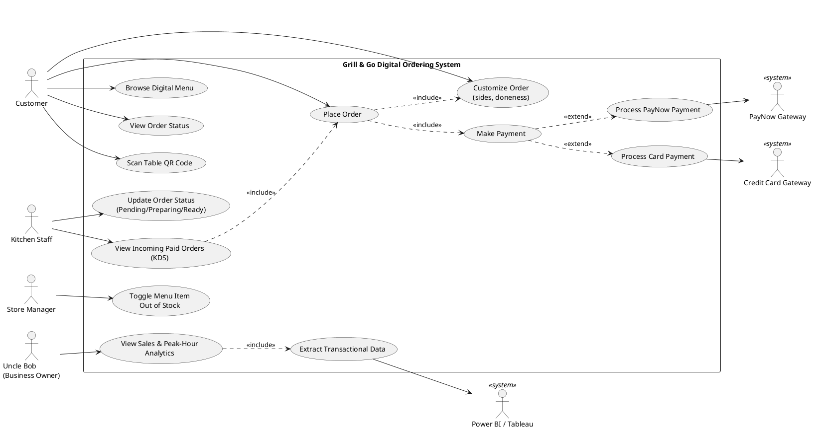

# User Requirements Specification (URS)
## Grill & Go — Digital Ordering & Fulfilment System

**Client:** Uncle Bob, Owner, Grill & Go (Orchard Road, Singapore)
**Prepared by:** [Student A Name], Lead Systems Analyst
**Document Version:** 1.0
**Date:** October 2026

---

## 1. Introduction & Business Context

Grill & Go is a small-business Western food stall serving approximately
30,000 unique customer orders per month (~1,000 orders/day), with sharp
demand peaks during lunch (12PM–2PM) and dinner (6PM–9PM) service. Long
physical queues during these peaks are causing customer drop-off and
kitchen delays.

This document specifies the user-facing requirements for a digital
ordering and fulfilment system that allows customers to order and pay
from their table via a QR code, routes only paid orders to the kitchen,
gives kitchen staff a digital order queue, and gives the Store Manager
real-time control over menu stock availability.

### 1.1 Scope

In scope: customer self-ordering via mobile browser, mandatory
pre-kitchen payment (PayNow / Credit Card), Kitchen Display System (KDS)
workflow, real-time stock toggling, and read-only BI integration
(Power BI / Tableau) against the transactional database.

Out of scope: native mobile apps, loyalty/rewards programs, third-party
delivery platform integration, and staff scheduling/payroll.

### 1.2 Stakeholders

| Role | Description |
| :--- | :--- |
| Customer | Diner seated at a table who orders and pays via their own mobile browser |
| Kitchen Staff | Uses a tablet (KDS) to view and progress paid orders |
| Store Manager | Toggles menu item availability in real time |
| Uncle Bob (Business Owner) | Reviews revenue and peak-hour performance via Power BI/Tableau |

---

## 2. Agile User Stories & BDD Acceptance Criteria

Each story follows the standard Agile format —
`As a <role>, I want <goal>, so that <benefit>` — with acceptance
criteria expressed in Given–When–Then (Behaviour-Driven Development)
notation.

### US-01: Scan QR Code to Access Menu (Customer)

> As a **Customer**, I want to scan a table-specific QR code to open the
> digital menu, so that I can start ordering without downloading an app.

**Acceptance Criteria:**
```gherkin
Given I am seated at Table 12 with a printed QR code
When I scan the QR code with my phone camera
Then my mobile browser opens the Grill & Go menu page
And the order I create is automatically associated with Table 12
And I am not required to install any application
```

### US-02: Customize Order Items (Customer)

> As a **Customer**, I want to customize my order (e.g. side dish, steak
> doneness), so that my meal matches my preferences.

**Acceptance Criteria:**
```gherkin
Given I have added a "Ribeye Steak" to my cart
When I select "Medium Rare" for doneness and "Fries" as my side
Then my cart line item reflects the selected customizations
And the unit price updates automatically if the customization changes the price

Given a menu item has no customer-selectable options
When I add it to my cart
Then no customization prompt is shown
```

### US-03: Pay Before Order Reaches Kitchen (Customer)

> As a **Customer**, I want to pay immediately via PayNow QR or Credit
> Card when I submit my order, so that my order is confirmed and sent to
> the kitchen without delay.

**Acceptance Criteria:**
```gherkin
Given I have finalised my cart and tapped "Checkout"
When I choose "PayNow" and scan the generated SGQR code with my banking app
Then my payment is confirmed within 15 seconds via webhook callback
And my order status changes from "Pending Payment" to "Paid"
And the order is transmitted to the Kitchen Display System only after payment succeeds

Given my payment fails or times out
When the gateway returns a failure response
Then my order remains in "Pending Payment" status
And it is NOT sent to the kitchen
And I am shown a retry option
```

### US-04: Track Order Status (Customer)

> As a **Customer**, I want to see my order's live status, so that I know
> when to expect my food.

**Acceptance Criteria:**
```gherkin
Given my order has been paid and sent to the kitchen
When the kitchen updates the status to "Preparing" or "Ready for Pickup"
Then my mobile browser reflects the updated status within 10 seconds
```

### US-05: View Incoming Paid Orders on KDS (Kitchen Staff)

> As a **Kitchen Staff member**, I want to see only paid orders on the
> Kitchen Display System (KDS), so that I never prepare food that hasn't
> been paid for.

**Acceptance Criteria:**
```gherkin
Given a customer's payment has been confirmed
When the order is created in the system
Then the order appears on the KDS tablet with status "Pending"
And unpaid or failed-payment orders never appear on the KDS

Given multiple paid orders arrive during peak hours
When the KDS refreshes
Then orders are displayed in ascending order of payment timestamp (FIFO)
```

### US-06: Update Order Status (Kitchen Staff)

> As a **Kitchen Staff member**, I want to update an order's status as I
> work on it, so that the customer and other staff know its progress.

**Acceptance Criteria:**
```gherkin
Given an order is showing status "Pending" on the KDS
When I tap "Start Preparing"
Then the order status changes to "Preparing" for all viewers (customer app, KDS)

Given an order is showing status "Preparing"
When I tap "Mark Ready"
Then the order status changes to "Ready for Pickup"
And the customer's app is updated within 10 seconds
```

### US-07: Toggle Menu Item Stock (Store Manager)

> As a **Store Manager**, I want to mark a menu item as "Out of Stock" in
> real time, so that customers cannot order items we can no longer serve.

**Acceptance Criteria:**
```gherkin
Given the kitchen has run out of Ribeye Steak
When I toggle "Ribeye Steak" to "Out of Stock" on the Manager Console
Then the item is immediately hidden or greyed out on all active customer menus
And any customer with the item already in an unpaid cart is warned before checkout

Given an item was marked "Out of Stock"
When I toggle it back to "In Stock"
Then it becomes orderable again within seconds, with no app restart required
```

### US-08: View Peak-Hour Sales Analytics (Business Owner)

> As **Uncle Bob (Business Owner)**, I want to view revenue and
> peak-hour sales trends using Power BI or Tableau, so that I can make
> staffing and menu decisions without needing custom dashboards built.

**Acceptance Criteria:**
```gherkin
Given the transactional database contains completed orders and payments
When I open the Power BI report connected to the reporting database
Then I can see revenue broken down by hour of day and by menu category
And the data reflects orders that are at least 5 minutes old (near real-time)
```

---

## 3. UML Use Case Diagram

The diagram below illustrates the primary human actors (Customer, Kitchen
Staff, Store Manager, Uncle Bob), the system actors (PayNow Gateway,
Credit Card Gateway, Power BI/Tableau), the functional use cases, and the
`<<include>>` / `<<extend>>` dependencies between them (e.g. "Place
Order" **includes** "Make Payment"; "Make Payment" **extends** to either
"Process PayNow Payment" or "Process Card Payment" depending on the
method chosen).


Source file: [`diagrams/use_case_diagram.puml`](diagrams/use_case_diagram.puml)



### 3.1 Use Case Descriptions (Summary Table)

| Use Case | Primary Actor | Includes/Extends | Description |
| :--- | :--- | :--- | :--- |
| Scan Table QR Code | Customer | — | Entry point to the digital menu, bound to a table |
| Browse Digital Menu | Customer | — | View available items, prices, categories |
| Customize Order | Customer | Included by Place Order | Select sides, doneness, quantities |
| Place Order | Customer | Includes: Customize Order, Make Payment | Submits cart as an order |
| Make Payment | Customer | Extends to: PayNow / Card | Collects mandatory payment before kitchen transmission |
| View Order Status | Customer | — | Polls/receives live order state |
| View Incoming Paid Orders (KDS) | Kitchen Staff | Includes: Place Order (paid orders only) | Kitchen queue view |
| Update Order Status | Kitchen Staff | — | Pending → Preparing → Ready |
| Toggle Menu Item Out of Stock | Store Manager | — | Real-time stock override |
| View Sales & Peak-Hour Analytics | Uncle Bob | Includes: Extract Transactional Data | Power BI/Tableau reporting |

---

## 4. Non-Functional Requirements (Summary)

| Category | Requirement |
| :--- | :--- |
| Throughput | Support ~30,000 orders/month; peak bursts of up to 100 concurrent mobile browser sessions |
| Availability | 99.5% uptime during operating hours (11AM–10PM SGT) |
| Performance | Menu page load < 2 seconds on 4G; order status refresh ≤ 10 seconds |
| Security | PCI-DSS compliant payment handling (no raw card data stored); TLS 1.2+ for all traffic |
| Usability | No app installation; usable on any modern mobile browser (Safari/Chrome) |
| Data Integrity | Orders are only forwarded to the kitchen after payment confirmation is persisted |

*(Full technical NFRs with measurable targets are detailed in the
Technical Design Specification, Section 6.)*

---

## Document Approval & Client Sign-Off

By signing below, the undersigned parties acknowledge that they have
reviewed, understood, and approved the user requirements and scope
detailed within this User Requirements Specification (URS) document.

| Approval Role | Stakeholder Name | Organization / Position | Approval Status | Timestamp (SGT) | Digital Sign-Off (Git ID) |
| :--- | :--- | :--- | :--- | :--- | :--- |
| **Client / Business Owner** | Uncle Bob | Owner, Grill & Go (Orchard Road) | **APPROVED** | 2026-10-12 14:30 | `@studentA-analyst` |
| **Lead Systems Analyst** | [Student A Name] | SE Solutions Project Lead | **APPROVED** | 2026-10-12 14:30 | `@studentA-analyst` |
