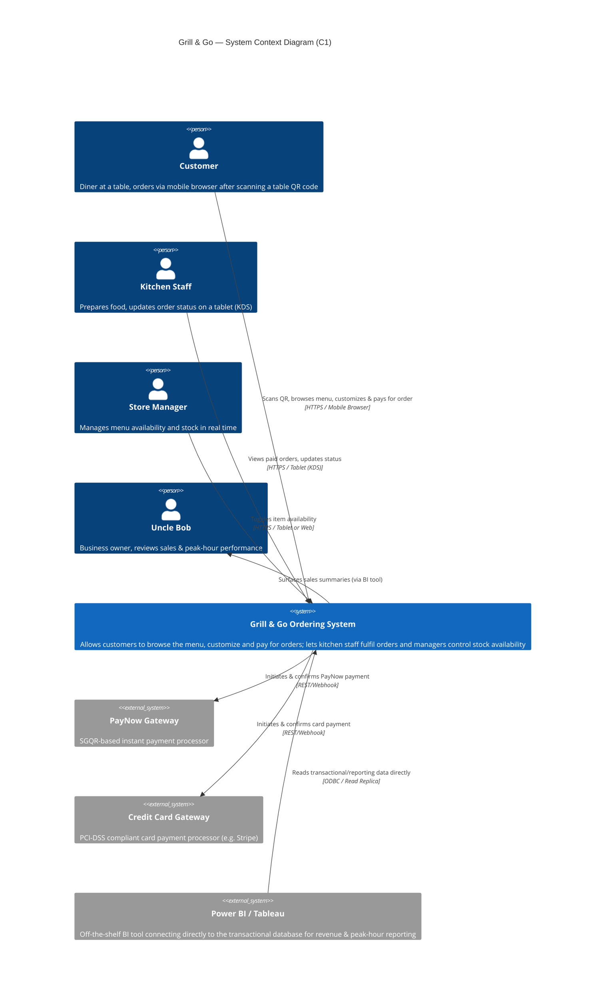
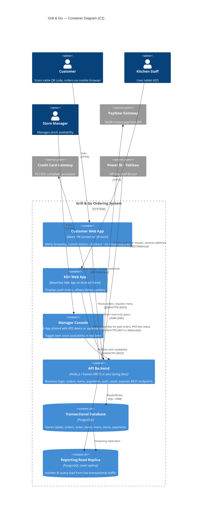
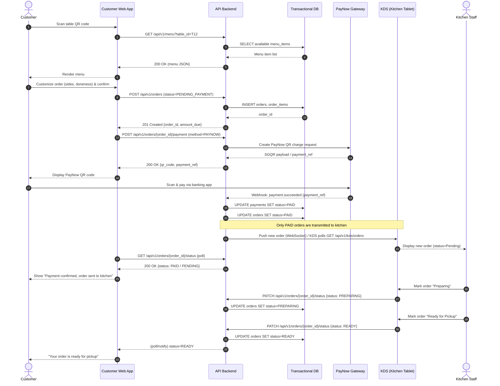
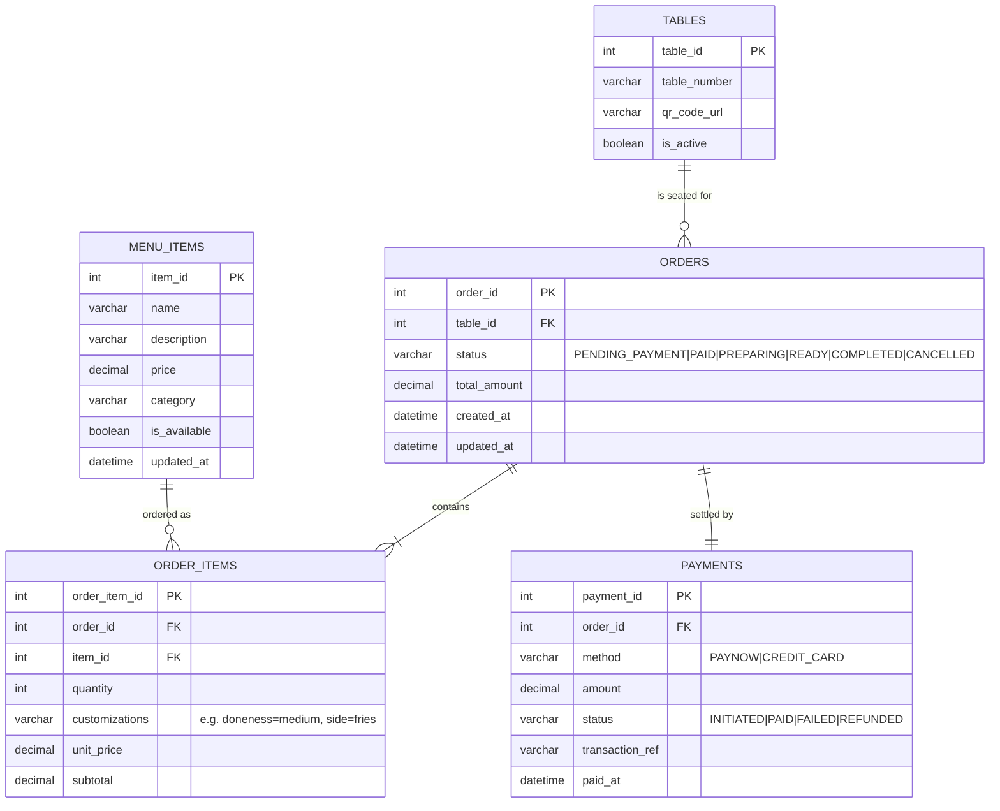

# Technical Design Specification (TDS)
## Grill & Go — Digital Ordering & Fulfilment System

**Prepared by:** [Student B Name], Software Architect / Lead Developer
**Reviewed by:** [Student C Name], Integration & BI Specialist
**Document Version:** 1.0
**Date:** October 2026

---

## 1. C4 Architecture Model

### 1.1 C1 — System Context Diagram

Shows the system boundary, the human actors, and the external systems it
integrates with (PayNow Gateway, Credit Card Gateway, Power BI/Tableau).

Source file: [`diagrams/c1_system_context.mmd`](diagrams/c1_system_context.mmd)



### 1.2 C2 — Container Diagram

Shows the technology stack choices: Customer Web App, KDS Web App,
Manager Console, API Backend, and the Relational Database (plus a
reporting read-replica for BI isolation).

Source file: [`diagrams/c2_container_diagram.mmd`](diagrams/c2_container_diagram.mmd)



### 1.3 Technology Stack Justification

| Container | Choice | Justification |
| :--- | :--- | :--- |
| Customer Web App | React SPA, mobile-first, no login | Meets the "no app download" constraint; QR code links directly to a table-scoped URL |
| KDS Web App | React/Vue on Android tablet, WebSocket or 5s polling | Kitchen needs near-real-time updates; a browser-based tablet app avoids native app deployment overhead |
| API Backend | Stateless REST API, horizontally scalable | 100 concurrent sessions at peak is easily handled by 2–3 small stateless instances behind a load balancer |
| Database | PostgreSQL | Strong relational/ACID guarantees needed for payment-linked orders; well-supported by Power BI/Tableau connectors |
| Reporting Replica | Streaming read replica | Prevents BI query load (Power BI/Tableau) from degrading live transactional performance |

---

## 2. UML Sequence Diagram — Order Placement & PayNow Payment Flow

This diagram shows the time-ordered interaction across all lifelines:
Customer, Customer Web App, API Backend, Transactional DB, PayNow
Gateway, KDS, and Kitchen Staff — including the asynchronous webhook
callback from the payment gateway and the rule that **unpaid orders are
never transmitted to the kitchen**.

Source file: [`diagrams/sequence_order_payment.mmd`](diagrams/sequence_order_payment.mmd)



---

## 3. Database Schema (Entity-Relationship Diagram)

Source file: [`diagrams/erd_database_schema.mmd`](diagrams/erd_database_schema.mmd)




### 3.1 Table & Cardinality Notes

| Relationship | Cardinality | Notes |
| :--- | :--- | :--- |
| `tables` → `orders` | 1 : N | A table can have many orders over time; each order belongs to exactly one table |
| `orders` → `order_items` | 1 : N (min 1) | An order must have at least one item |
| `menu_items` → `order_items` | 1 : N | A menu item can appear in many order lines; `unit_price` is snapshotted onto `order_items` at order time so later price changes don't retroactively alter historical orders |
| `orders` → `payments` | 1 : 1 (per successful payment) | Modelled 1:1 for the happy path; a `payment_id` history table could extend this to 1:N to support retry/refund audit trails |

All primary keys are surrogate auto-incrementing integers (or UUIDs for
distributed-safety); all foreign keys enforce `ON DELETE RESTRICT` to
preserve financial audit history.

---

## 4. API Interface Specifications

Base URL: `https://api.grillandgo.sg/api/v1`
Auth: Manager/Kitchen endpoints require a bearer token (staff login);
Customer-facing endpoints are scoped by a signed `table_id` token issued
on QR scan.

### 4.1 `POST /api/v1/orders`

Creates a new order (initial status `PENDING_PAYMENT`) for a table.

**Request Body:**
```json
{
  "table_id": 12,
  "items": [
    {
      "item_id": 101,
      "quantity": 1,
      "customizations": { "doneness": "medium_rare", "side": "fries" }
    },
    {
      "item_id": 205,
      "quantity": 2,
      "customizations": {}
    }
  ]
}
```

**Success Response — `201 Created`:**
```json
{
  "order_id": 58231,
  "table_id": 12,
  "status": "PENDING_PAYMENT",
  "total_amount": 34.50,
  "currency": "SGD",
  "items": [
    { "order_item_id": 1, "item_id": 101, "quantity": 1, "unit_price": 22.00, "subtotal": 22.00 },
    { "order_item_id": 2, "item_id": 205, "quantity": 2, "unit_price": 6.25, "subtotal": 12.50 }
  ],
  "created_at": "2026-10-12T12:31:04+08:00"
}
```

**Error Responses:**
| Status | Condition | Body |
| :--- | :--- | :--- |
| `400 Bad Request` | Empty `items` array or invalid `item_id` | `{"error": "INVALID_ORDER", "message": "..."}` |
| `409 Conflict` | One or more items became `is_available=false` between menu load and submit | `{"error": "ITEM_OUT_OF_STOCK", "item_ids": [101]}` |
| `422 Unprocessable Entity` | Missing required customization (e.g. doneness) | `{"error": "MISSING_CUSTOMIZATION", "item_id": 101, "field": "doneness"}` |

### 4.2 `PATCH /api/v1/menu/items/{item_id}`

Used by the Store Manager Console to toggle stock availability in real
time (and, optionally, other menu attributes).

**Path Parameter:** `item_id` (integer, required)

**Request Body:**
```json
{
  "is_available": false
}
```

**Success Response — `200 OK`:**
```json
{
  "item_id": 101,
  "name": "Ribeye Steak",
  "is_available": false,
  "updated_at": "2026-10-12T13:05:22+08:00"
}
```

**Error Responses:**
| Status | Condition | Body |
| :--- | :--- | :--- |
| `401 Unauthorized` | Missing/invalid staff bearer token | `{"error": "UNAUTHORIZED"}` |
| `404 Not Found` | `item_id` does not exist | `{"error": "ITEM_NOT_FOUND"}` |
| `400 Bad Request` | Body missing `is_available` or wrong type | `{"error": "INVALID_PAYLOAD"}` |

> **Note:** on success, the API broadcasts the updated availability to all
> active customer sessions (via WebSocket or short-TTL cache invalidation)
> so menus reflect the change within seconds without a page reload.

---

## 5. Requirements Traceability Matrix (RTM)

| Business Requirement | User Story | Use Case | API / DB Component |
| :--- | :--- | :--- | :--- |
| Customers order via QR without app download | US-01 | Scan Table QR Code | `GET /api/v1/menu`; `tables` table |
| Customers customize dishes (sides, doneness) | US-02 | Customize Order | `order_items.customizations`; `POST /api/v1/orders` |
| Orders must be paid before reaching the kitchen | US-03 | Place Order, Make Payment | `POST /api/v1/orders`, `POST /api/v1/orders/{id}/payment`; `payments`, `orders.status` |
| Customers track order progress | US-04 | View Order Status | `GET /api/v1/orders/{id}/status`; `orders.status` |
| Kitchen sees only paid orders | US-05 | View Incoming Paid Orders (KDS) | `GET /api/v1/kds/orders` (filtered `status=PAID`); `orders` |
| Kitchen updates order progress | US-06 | Update Order Status | `PATCH /api/v1/orders/{id}/status`; `orders.status` |
| Manager controls stock in real time | US-07 | Toggle Menu Item Out of Stock | `PATCH /api/v1/menu/items/{item_id}`; `menu_items.is_available` |
| Owner reviews revenue/peak-hour analytics via BI tool | US-08 | View Sales & Peak-Hour Analytics | Reporting read replica; Power BI/Tableau direct connection over `orders`, `payments` |
| System handles 30,000 orders/month, 100 concurrent peak sessions | *(NFR — see §6)* | *(cross-cutting)* | Stateless API Backend behind load balancer; connection pooling on DB |

---

## 6. Non-Functional Requirements (Measurable)

| # | Category | Requirement | Target / Metric |
| :--- | :--- | :--- | :--- |
| NFR-1 | Throughput | System sustains normal and peak load | 30,000 orders/month average; ≥100 concurrent mobile sessions at peak with < 1% request error rate |
| NFR-2 | Latency | Menu and order APIs respond quickly | 95th percentile API response time < 500ms; menu page first-contentful-paint < 2s on 4G |
| NFR-3 | Payment Security | No sensitive card data touches Grill & Go servers | PCI-DSS SAQ-A compliance via tokenized gateway integration (Stripe/equivalent); TLS 1.2+ enforced on all endpoints |
| NFR-4 | Data Consistency | Kitchen never sees unpaid orders | 100% of orders shown on KDS have `payments.status = PAID`, enforced at the API/query layer, not just the UI |
| NFR-5 | Availability | Minimise downtime during service hours | 99.5% uptime, 11AM–10PM SGT; automated failover for the API tier |
| NFR-6 | Real-Time Sync | Stock toggles and status updates propagate quickly | Menu availability and order status changes visible to all active clients within 10 seconds |
| NFR-7 | Reporting Isolation | BI queries do not degrade transactional performance | Power BI/Tableau connects only to the read replica, never the primary transactional DB |
| NFR-8 | Auditability | Financial and stock actions are traceable | All payment state transitions and stock toggles are timestamped and immutable (append-only audit log) |

---

## Document Approval & Technical Sign-Off

By signing below, the undersigned engineering leads acknowledge that the
architecture, schema, and API specifications detailed within this
Technical Design Specification (TDS) are technically feasible, scalable
to 30,000 monthly transactions, and approved for implementation.

| Approval Role | Engineer Name | Project Role | Approval Status | Timestamp (SGT) | Digital Sign-Off (Git ID) |
| :--- | :--- | :--- | :--- | :--- | :--- |
| **Lead Systems Analyst** | [Student A Name] | Systems Analyst / Author | **APPROVED** | 2026-10-12 16:00 | `@studentA-analyst` |
| **Lead Software Engineer** | [Student B Name] | Software Architect / Lead Developer | **APPROVED** | 2026-10-12 16:15 | `@studentB-developer` |
| **QA & Data Engineer** | [Student A Name] | Integration & BI Specialist | **APPROVED** | 2026-10-12 16:30 | `@studentA-qa` |
